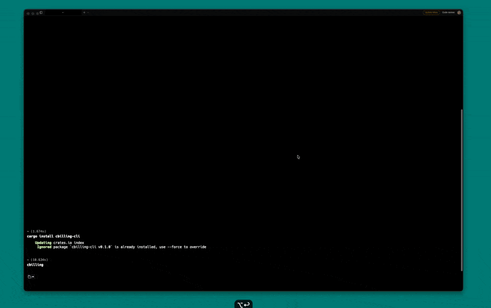

# cbilling-cli

[](https://crates.io/crates/cbilling-cli)
[](../../LICENSE)

Terminal dashboard and CLI for multi-cloud billing — query, compare, and export billing data from AWS, GCP, Aliyun, Tencent Cloud, Volcengine, UCloud, and Cloudflare.

<div align="center">



</div>

## Install

```bash
cargo install cbilling-cli
```

Or download pre-built binaries from [GitHub Releases](https://github.com/Liberxue/cbilling/releases).

## Usage

### TUI Dashboard (default)

```bash
cbilling
```

Launches an interactive terminal UI with:

- Provider tabs with real-time cost totals
- Bar chart showing cost distribution across providers
- Sortable product table with MoM (month-over-month) comparison
- Search/filter, mouse scroll, keyboard navigation

### CLI Commands

```bash
# List configured providers
cbilling providers

# Query a specific provider
cbilling query aliyun
cbilling query aws --month 2026-02

# Export to CSV
cbilling query tencentcloud --month 2026-03 --csv billing.csv

# Summary across all providers
cbilling summary
cbilling summary --month 2026-01
```

### Command Reference

```
cbilling [COMMAND]

Commands:
  query      Query billing data for a specific provider and month
  providers  List all configured cloud providers
  summary    Query all providers and print summary
  help       Print this message or the help of the given subcommand(s)

Options:
  -h, --help     Print help
  -V, --version  Print version
```

**query**

```
cbilling query <PROVIDER> [OPTIONS]

Arguments:
  <PROVIDER>  Cloud provider: aliyun, aws, tencentcloud, volcengine, ucloud, gcp, cloudflare

Options:
  -m, --month <YYYY-MM>  Billing month (defaults to current)
      --csv <FILE>       Export results to CSV file
```

**summary**

```
cbilling summary [OPTIONS]

Options:
  -m, --month <YYYY-MM>  Billing month (defaults to current)
```

### Output Examples

```
$ cbilling providers
PROVIDER         STATUS
------------------------------
aliyun           ready
tencentcloud     ready
aws              ready

3 provider(s) configured
```

```
$ cbilling query aws --month 2026-02
Querying aws for 2026-02...

#    PRODUCT                        CODE                         COST    QTY REGIONS
------------------------------------------------------------------------------------------
1    Amazon Elastic Compute Clou... Amazon Elastic Co...      1792.78      - -
2    EC2 - Other                    EC2 - Other               1638.64      - -
3    Amazon Relational Database ... Amazon Relational...       423.82      - -
...
------------------------------------------------------------------------------------------
Total: 4332.39 USD  (25 products)
```

```
$ cbilling summary --month 2026-02
Querying 3 provider(s) for 2026-02...

PROVIDER                   COST CUR   PRODUCTS
------------------------------------------------
aliyun                 98765.43 CNY         65
tencentcloud           33618.72 CNY         12
aws                     4332.39 USD         25
------------------------------------------------
TOTAL                 132384.15 CNY
TOTAL                   4332.39 USD
```

## TUI Keyboard Shortcuts

| Key | Action |
|:---|:------|
| `j` / `k` | Navigate up/down |
| `Ctrl+f` / `Ctrl+b` | Page down/up |
| Mouse scroll | Scroll table |
| `g` / `G` | Jump to top/bottom |
| `Tab` / `h` / `l` | Switch provider tab |
| `Left` / `Right` | Previous/next month |
| `s` / `S` | Cycle sort column / toggle direction |
| `1`-`5` | Sort by column directly |
| `Enter` | Expand/collapse region details |
| `/` | Search/filter |
| `Esc` | Clear filter |
| `r` | Refresh |
| `?` | Help |
| `q` | Quit |

## Configuration

See the [main project README](../../README.md#configuration) for environment variable setup per provider.

## License

Apache-2.0
